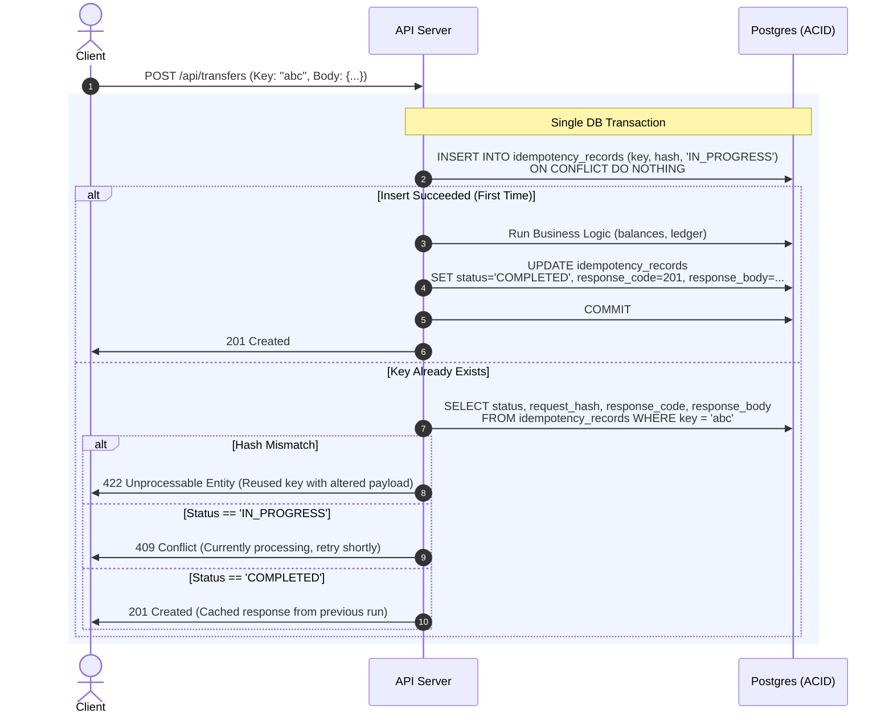

A user taps "Confirm Payment". Their phone drops off 5G while walking into a subway station. Three seconds later, the HTTP request times out.

What does the mobile client do? It retries.

What actually happened on your backend? Did the first request die before reaching your API gateway? Or did your database commit the transaction, charge the card, and drop the connection right as it was writing the HTTP 200 response back to the client?

The client has no idea. Your server doesn't either—unless you engineered an explicit contract for it.

In distributed systems, networks drop packets. Gateways time out. Worker nodes crash mid-transaction. Because of this, **at-least-once delivery is the only guarantee physical networks can ever give you.** Exactly-once delivery is a marketing myth. If clients retry—and they must—your APIs have to make duplicate executions safe.

That is idempotency. Not textbook math formulas, but the practical engineering required so a retried network request doesn't bill a user twice or corrupt your ledger.

---

## The Naive Redis Trap: `SETNX` Is Not Idempotency

Almost every online tutorial recommends the exact same quick fix:
> *"Stick an `Idempotency-Key` header on the request. In your middleware, run `SETNX idempotency_key 1 EX 60` in Redis. If it returns 1, process the request. If it returns 0, throw a 409 Conflict."*

It takes twenty lines of code. It passes unit tests. And in production, it will silently corrupt your business data.

Here is why:

```
Client               API Gateway / App Worker               Redis                 Database
  |                             |                             |                      |
  |--- POST /pay (Key: 123) --->|                             |                      |
  |                             |--- SETNX key_123 (OK) ----->|                      |
  |                             |                                                    |
  |                             |=========== WORKER OOM / NODE REBOOT ===============|
  |                             | (Process dies before writing to DB or charging card)
  |                             x
  | (Timeout: 5s)
  |
  |--- RETRY POST (Key: 123) -->|
                                |--- SETNX key_123 (EXISTS) ->|
                                |<-- Return False ------------|
                                |
                                |---> Returns 409 Conflict (or "Already Processed")
```

Look closely at what happens when things go wrong:

1. **The Crash Window:** Between the moment Redis returns `OK` for your lock and the moment your code finishes writing to PostgreSQL, your app can die. A Kubernetes node reschedule, an out-of-memory kill, or a sudden segfault. The key stays locked in Redis. The client retries, gets rejected with `409 Conflict` or a bogus "already processed" response, and the customer's payment is permanently lost.
2. **Eviction and Failover:** Redis is an in-memory cache. Under memory pressure, keys get evicted under LRU policies. During a Sentinel or Cluster failover, asynchronous replication lag can drop keys that were acknowledged milliseconds earlier.
3. **Execution Exceeds TTL:** If your database experiences a sudden lock spike, the request might take 65 seconds. If your Redis TTL was 60 seconds, Redis quietly expires the key. The client's retry arrives, acquires the lock again, and runs a second concurrent mutation against your database.

The lesson is simple: **If your business state lives in a relational database, your idempotency state must live in the same database, committed inside the exact same ACID transaction.**

---

## Pattern 1: Natural Idempotency (The Best Code is No Code)

Before adding tables, check whether your domain logic can be made idempotent by design. Many operations don't need dedicated tokens at all.

* **Non-idempotent:**
  ```sql
  UPDATE accounts SET balance = balance - 100 WHERE id = 42;
  ```
  Run this twice, lose $200.

* **Naturally idempotent state machine:**
  ```sql
  UPDATE orders 
  SET status = 'CANCELLED', cancelled_at = NOW() 
  WHERE id = 42 AND status IN ('PENDING', 'AWAITING_PAYMENT');
  ```
  Run this once: `rows_affected = 1`. Run it five more times: `rows_affected = 0`. The final state of the database is identical every single time.

* **Naturally idempotent upsert:**
  ```sql
  INSERT INTO user_subscriptions (user_id, plan_id, billing_cycle_start)
  VALUES (101, 'pro_annual', '2026-09-01')
  ON CONFLICT (user_id, billing_cycle_start) 
  DO UPDATE SET plan_id = EXCLUDED.plan_id;
  ```

If your operation is already an idempotent state transition or a unique composite-key upsert, don't overcomplicate it. You don't need an idempotency engine.

---

## Pattern 2: The ACID Idempotency Engine

When an endpoint touches multiple tables, produces audit logs, or charges money, you need an atomic idempotency record.

Here is a schema that has survived heavy production traffic:

```sql
CREATE TABLE idempotency_records (
    idempotency_key VARCHAR(255) PRIMARY KEY,
    request_path    VARCHAR(255) NOT NULL,
    request_hash    CHAR(64) NOT NULL,       -- SHA-256 of request payload
    status          VARCHAR(32) NOT NULL,    -- 'IN_PROGRESS', 'COMPLETED', 'FAILED'
    response_code   INT NULL,
    response_body   JSONB NULL,
    created_at      TIMESTAMPTZ NOT NULL DEFAULT NOW(),
    updated_at      TIMESTAMPTZ NOT NULL DEFAULT NOW()
);

CREATE INDEX idx_idempotency_records_created_at 
ON idempotency_records (created_at);
```

### The Request Lifecycle



### Production Implementation

Here is how to structure this in Node.js and PostgreSQL without leaking locks or corrupting state:

```typescript
import { createHash } from "node:crypto";
import type { Request, Response } from "express";
import { pool } from "./db";

export async function handleTransfer(req: Request, res: Response) {
  const idempotencyKey = req.header("Idempotency-Key");
  if (!idempotencyKey) {
    return res.status(400).json({ error: "Missing Idempotency-Key header" });
  }

  // 1. Hash the body so nobody can swap payloads under the same key
  const requestPayload = JSON.stringify(req.body);
  const requestHash = createHash("sha256").update(requestPayload).digest("hex");

  const client = await pool.connect();
  try {
    await client.query("BEGIN TRANSACTION ISOLATION LEVEL READ COMMITTED");

    // 2. Try to claim the key atomically
    const claim = await client.query(
      `INSERT INTO idempotency_records (idempotency_key, request_path, request_hash, status)
       VALUES ($1, $2, $3, 'IN_PROGRESS')
       ON CONFLICT (idempotency_key) DO NOTHING
       RETURNING idempotency_key`,
      [idempotencyKey, req.originalUrl, requestHash]
    );

    // If rowCount is 0, another request already claimed or finished this key
    if (claim.rowCount === 0) {
      const existing = await client.query(
        `SELECT request_hash, status, response_code, response_body 
         FROM idempotency_records 
         WHERE idempotency_key = $1 FOR SHARE`,
        [idempotencyKey]
      );
      await client.query("COMMIT");

      const record = existing.rows[0];

      // Trap 1: Client reused the key with different data
      if (record.request_hash !== requestHash) {
        return res.status(422).json({
          error: "Idempotency key reused with different request payload.",
        });
      }

      // Trap 2: Previous attempt is still executing
      if (record.status === "IN_PROGRESS") {
        res.setHeader("Retry-After", "2");
        return res.status(409).json({
          error: "Request with this idempotency key is currently processing.",
        });
      }

      // Return the cached result from the first successful execution
      return res.status(record.response_code).json(record.response_body);
    }

    // 3. First execution: run domain logic
    const result = await executeTransfer(client, req.body);
    const statusCode = 201;

    // 4. Save response within the exact same transaction
    await client.query(
      `UPDATE idempotency_records
       SET status = 'COMPLETED',
           response_code = $1,
           response_body = $2,
           updated_at = NOW()
       WHERE idempotency_key = $3`,
      [statusCode, JSON.stringify(result), idempotencyKey]
    );

    await client.query("COMMIT");
    return res.status(statusCode).json(result);

  } catch (err) {
    await client.query("ROLLBACK");

    // Clear the in-progress row so the client is not locked out forever
    await pool.query(
      `DELETE FROM idempotency_records WHERE idempotency_key = $1 AND status = 'IN_PROGRESS'`,
      [idempotencyKey]
    ).catch(() => {});

    throw err;
  } finally {
    client.release();
  }
}
```

---

## Pattern 3: Two-Phase External API Calls (Stripe, Twilio)

What happens when your endpoint has to talk to an external third-party API, like charging a card via Stripe or sending an SMS?

You cannot roll back a credit card charge with a database `ROLLBACK`.

If your server charges Stripe and then crashes before committing to PostgreSQL, the customer was billed, but your database says the order failed. If the client retries, a naive worker will charge them again.

To fix this:

1. **Derive Downstream Keys Deterministically:** Never generate a random `crypto.randomUUID()` when calling Stripe. Instead, derive the third-party idempotency key directly from your incoming request key:
   ```typescript
   const stripeKey = `charge_${incomingIdempotencyKey}`;
   
   const charge = await stripe.charges.create(
     { amount: 5000, currency: "usd", customer: customerId },
     { idempotencyKey: stripeKey }
   );
   ```
2. **Intent Before Execution:** Save a pending payment record in PostgreSQL *before* calling Stripe. If the external network call drops or times out, the retry uses the same deterministic `stripeKey`. Stripe's API will recognize the duplicate key and safely return the existing charge object instead of billing twice.

---

## Production Gotchas You Only Learn at 2 AM

### 1. The Accidental Key Reuse Bug
Clients have bugs. Frontends occasionally hardcode a test UUID or generate a key on page load instead of on form submission. A user buys item A, navigates back, and buys item B under the same key.

If you only check that the key exists and return the cached response, the user gets charged for item B, gets item A's receipt, and your database ends up in an inconsistent mess.

**The rule:** Always verify the SHA-256 hash of the payload against the stored record. If the key matches but the hash doesn't, immediately reject the call with `422 Unprocessable Entity`.

### 2. Never Cache 500 Internal Server Errors
If your database connection pool gets exhausted or an internal service times out, your server throws a 500.

If your idempotency layer catches that 500 and records it as `COMPLETED`, you have just permanently locked that user out. Every automated retry with exponential backoff will faithfully return the cached 500 error.

Only cache successful mutations (`2xx`) and deterministic client validation errors (`4xx`). If your server blows up on an unhandled exception, wipe the `IN_PROGRESS` row so the next retry gets a clean slate.

### 3. The 200ms Mobile Retry Stampede
Mobile apps on flaky connections often fire duplicate retries aggressively. If your timeout is 250ms and your database takes 300ms under load, the second request will hit your server while the first request is still writing.

Without a database-level unique constraint or an atomic lock, both requests will run in parallel, both will pass the "no record found" check, and both will execute.

Rely on `ON CONFLICT DO NOTHING` on the primary key. Let the database handle serialization. The winner executes; the runner-up gets an immediate `409 Conflict` with a `Retry-After` header.

---

## What Actually Matters in Production

Building reliable distributed systems comes down to three operational rules:

1. **Keep state together:** Never store idempotency tokens in an in-memory cache while your business data lives in PostgreSQL. When the process crashes between them, your data corrupts.
2. **Hash the payload:** An idempotency key without a payload hash check is an invitation for silent data corruption.
3. **Plan for table growth:** Idempotency tables collect massive volume quickly. Partition by month or run a scheduled cleanup job deleting records older than 30 days. After a month, an in-flight retry is no longer a retry; it's a completely new business event.
